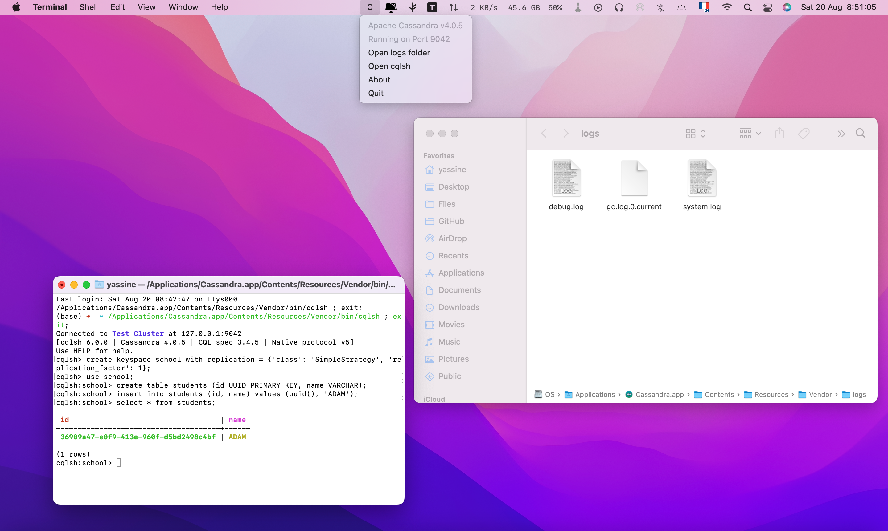

# Cassandra.app
### The easiest way to get started with Apache Cassandra on the Mac

*Just download, drag to the applications folder, and double-click.*



### [Download](https://github.com/Yassine-Lafryhi/CassandraApp/releases)

--

### Adding Cassandra binaries to your path

If you need to add the Cassandra binaries to your path you can do so by adding the following to your `~/.bash_profile`.

```bash
# Add Cassandra.app binaries to path
PATH="/Applications/Cassandra.app/Contents/Resources/Vendor/bin:$PATH"
```

### How to build

```bash
git clone https://github.com/Yassine-Lafryhi/CassandraApp.git
cd CassandraApp
wget https://dlcdn.apache.org/cassandra/4.0.5/apache-cassandra-4.0.5-bin.tar.gz
tar -xvzf apache-cassandra-4.0.5-bin.tar.gz
mv apache-cassandra-4.0.5 Vendor
rm apache-cassandra-4.0.5-bin.tar.gz
xcodebuild
open build/Release
```

### Credits

Forked and adapted from [Redis.app](https://github.com/jpadilla/redisapp).
